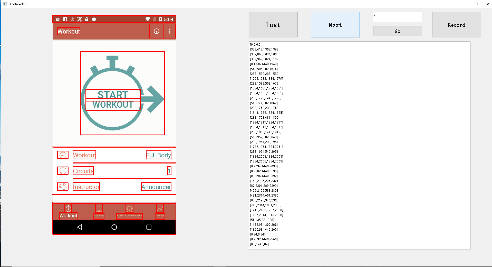
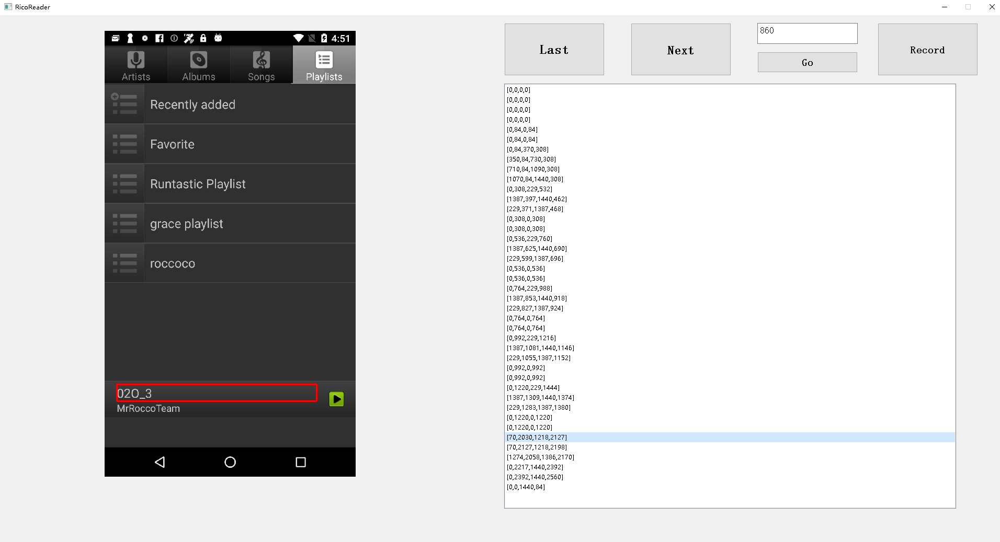

# RicoReader
A tool to read RICO dataset's img and json file, could be selected and record the points of elements

It is just an experimental tool for my final thesis paper. So you have any question or suggestion please leave an issue or contact me.

# Interface

## Every Block following:

> interface

>>Pic area

>>>Selected rect

>>>Picture

>>button area

>>> Last button: go to last picture

>>> Next button: go to next picture

>>> Index edit area: enter an index of RICO

>>> Go button: go to the picture of Index in Index edit area

>>> Record button: record the points and index of the selected item

>> Points list

>>> Points item: click to select one element

## Select one item in list:

